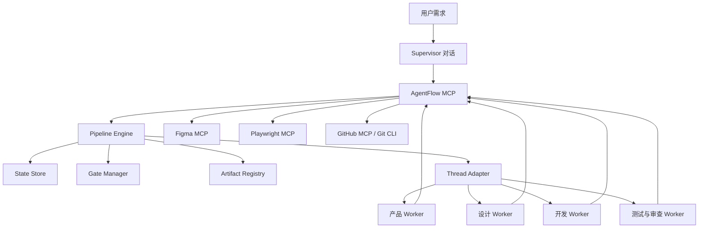

# AgentFlow 项目设计文档

> 状态：v0.3.0 全局安装候选（Pipeline 0.4.0；GitHub Release Gate 尚未批准）
> 调研日期：2026-07-15
> 目标：在同一个 Codex、Cursor 或 VS Code 客户端中，由一个主对话按阶段创建和管理多个工作对话，完成从需求、Figma 设计、开发、测试到发布的完整项目流程。

## 1. 执行摘要

AgentFlow 不是一组靠聊天记忆串联的提示词，而是一个有状态、可恢复、可审计的项目编排器。

系统采用以下分工：

- 主对话负责需求确认、任务拆分、子对话调度、阶段迁移和结果汇总。
- 子对话是按需创建的临时 Worker，每个 Worker 只有一个明确任务。
- Skill 规定阶段内的工作方法、输入、输出和检查清单。
- MCP 提供 Figma、浏览器、GitHub 和 AgentFlow 状态工具。
- 确定性脚本负责 Schema 校验、Git、测试、视觉比较和门禁检查。
- 用户负责需求范围、设计方向、完整设计冻结、工程计划和发布五类不可自动代替的决定。

外部 Skill 只作为受控依赖使用。跨客户端编排、PRD、UX 架构、设计方向比较、设计交付和阶段门禁由 AgentFlow 自己的 Skill 实现。

### 1.1 实现快照

截至 2026-07-16，M0 状态内核、M1 Codex Host 契约和 M2 产品到设计控制面已经落地：RunState 持久化 Task、Worker、原生任务 ID、能力快照、prompt 哈希、结构化结果和独占资源；AgentFlow MCP 提供 Worker 生命周期、Artifact 合约校验、Figma 单 Writer lease、逐调用 operation mutex，以及可恢复的 live capability preflight。测试覆盖两个并行实现 Worker、Supervisor 重启恢复、依赖 Review Worker，以及 Product Brief→PRD→UX→A/B/C→设计方向 Gate 的状态迁移。测试中的 Figma 返回值仅是 fixture，不是线上 Figma 执行证据。

v0.3.0 候选已经实现一次用户级 GitHub `npx` 安装、独立 CLI/MCP ESM bundle、三端用户配置安全合并、全局自动路由 Skill、逐调用项目根解析，以及带锁、journal 和请求幂等记录的懒初始化。普通项目变更先调用 `run_start_or_resume`，只在目标项目创建轻量 `.agentflow` 状态；纯问答、代码解释、只读检查、状态查询和简单非写命令不会初始化项目。根目录发行版本、CLI 和 MCP 均报告 `0.3.0`，但发行 tag、GitHub 推送和任何外部发布仍受 Release Gate 约束，尚未执行。

Codex 已实跑一次只读 Worker 闭环，以及一次双原生可写 Worker 前向测试；后者从同一 Git baseline 创建两个互不重叠的 worktree，并行完成提交，经 MCP 核验后集成到 `main`。Codex、Cursor、VS Code 三份用户级 MCP 配置和静态 `doctor` 均已通过；打包测试也证明同一个动态 MCP 可以为两个 Git 项目分别创建 Run，且项目之间不复制 runtime、Skills 或宿主配置。Cursor 和 VS Code 的原生 Worker Adapter 尚未实跑。当前会话没有暴露 Figma MCP 工具、resource/template 或 `figma-use` Skill，S04 live preflight 因此保持 blocked；项目没有声称创建任何 Figma 文件、node、截图或画布 Artifact，也不通过 GUI 自动化或伪造 OAuth 绕过阻断。

M3 的契约与本地执行控制面已经形成闭环：获批计划可原子物化为带 wave 屏障的 S11 Task DAG；计划固定 Git branch/base revision，`worker_dispatch_prepare` 从持久化 Task 确定性生成含可解析 Artifact locator 的 prompt，并在一个 revision 中保存 claim、经核验的 workspace 和 prepared Worker。除早期只读与双 Worker 前向测试外，`agentflow-live-worker-invariant` 已使用真实 Codex Workers 和隔离 worktrees 完成 S09-S15、系统 QA、获批的本地不可变发布及 final manifest。该证据证明内部非 UI 项目和本地发布存储的闭环，不代表外部生产部署、live Figma、浏览器/动态安全证据或 Cursor/VS Code 原生 Adapter 已验证。

## 2. 调研口径

[skills.sh](https://skills.sh/) 没有用户星级评分。其排行榜使用 `skills` CLI 的匿名安装遥测排序，因此安装量表示热度，不等于质量。[skills.sh 排名说明](https://skills.sh/docs)

本项目使用以下选型顺序：

1. 是否准确覆盖本阶段职责。
2. 是否能在 Codex、Cursor、VS Code 使用或被安全包装。
3. skills.sh 安装量和近期趋势。
4. skills.sh 安全审计结果。
5. 上游仓库维护状态、来源可信度和许可证。
6. 是否会执行命令、联网读取指令、静默更新或产生不可控副作用。

所有安装量均为 2026-07-15 的快照，不能作为版本锁。skills.sh 也明确提示安全审计不能保证每个 Skill 的质量和安全，安装前仍须人工复核源码。

## 3. 项目目标

### 3.1 必须实现

- 同一 IDE 内一个 Supervisor 对话管理多个 Worker 对话。
- Worker 可以并发执行互不冲突的调研、开发、测试和审查任务。
- 所有阶段均有显式输入、产物、自动检查和退出条件。
- 只有当前阶段需要的 Skill 和 MCP 工具才会被使用。
- 新项目默认经过需求发现、PRD、UX、设计方向、完整 Figma、工程计划、开发和验收。
- 已有项目先分析仓库、设计系统和现有 Figma，再决定跳过或缩小阶段。
- 无 UI 项目可以跳过 Figma 阶段。
- 用户修改已批准产物后，下游审批自动失效。
- 代码写入任务使用独立 Git worktree。
- 同一 Figma 文件同一时刻只有一个 Writer。
- 流程可以在进程重启、对话关闭或客户端切换后恢复。
- AgentFlow 对当前用户全局安装一次，新项目在首个变更请求时自动初始化。
- 多个项目使用同一全局 MCP 时保持逐项目状态、锁和并发，不建立全局队列。

### 3.2 不做

- 不通过鼠标键盘自动化操纵聊天窗口。
- 不依赖多个普通聊天窗口自行读取彼此历史。
- 不让 Agent 自动批准产品范围、设计方向或发布。
- 不允许多个 Worker 同时修改同一工作目录或同一 Figma 文件。
- 不把 skills.sh 安装量视为安全证明。
- 第一版不做云端多租户调度和计费系统。

## 4. 核心概念

| 概念 | 定义 |
|---|---|
| Run | 一次从用户需求开始的项目或变更流程 |
| Stage | 有固定输入、产物和退出条件的阶段 |
| Supervisor | 主对话，负责编排，不承担大块实现工作 |
| Worker | 由 Supervisor 创建的临时子对话 |
| Task | 可认领、可验证、最多一个当前 Owner 的工作单元 |
| Artifact | PRD、流程图、Figma 节点、代码、报告等可追踪产物 |
| Gate | 阶段迁移前必须满足的自动或人工条件 |
| Lease | Worker 对任务和写入范围的限时所有权 |
| Profile | 某类 Worker 可见的 Skill 与工具集合 |
| Adapter | 对 Codex、Cursor、VS Code 对话线程能力的适配层 |

## 5. 总体架构



### 5.1 核心组件

| 组件 | 职责 |
|---|---|
| Pipeline Engine | 解析阶段 DAG，判断 ready、blocked、stale 和 completed |
| State Store | 保存 Run、Task、Lease、Worker、Gate、事件和版本号 |
| Thread Manager | 创建、发送消息、查询、纠偏、中断和关闭 Worker 对话 |
| Artifact Registry | 保存路径、Figma node ID、内容哈希、来源和审批关系 |
| Gate Manager | 自动检查和人工批准，校验批准对象的哈希 |
| Worktree Manager | 创建隔离分支、执行基线测试、合并和清理 |
| Tool Policy | 按 Stage 和 Worker Profile 限制 MCP 与命令 |
| Integration Manager | 按依赖顺序审查、合并和重新验证 Worker 成果 |

### 5.2 Thread Adapter

不同客户端不应污染核心状态机，只实现统一接口：

```ts
interface ThreadAdapter {
  capabilities(): Promise<ThreadCapabilities>;
  spawn(input: SpawnWorkerInput): Promise<WorkerHandle>;
  send(workerId: string, message: WorkerMessage): Promise<void>;
  status(workerId: string): Promise<WorkerStatus>;
  collect(workerId: string): Promise<WorkerResult>;
  interrupt(workerId: string, reason: string): Promise<void>;
  close(workerId: string): Promise<void>;
}
```

适配优先级：

1. 使用客户端原生 Subagent 或 Background Agent 线程。
2. 使用客户端公开的 thread、CLI 或 extension API。
3. 使用独立 Agent CLI 进程作为降级方案。
4. 不使用 GUI 点击作为控制面。

适配器必须先运行能力探测。没有 `send` 或 `interrupt` 能力时，Supervisor 只能等待结果或取消进程，不能假装已经纠偏。

## 6. 多对话协作模型

### 6.1 Supervisor 约束

- 只直接修改 `.agentflow/` 中的流程产物和集成元数据。
- 负责把需求拆成 Task DAG，不直接接管已派发的 Worker 文件。
- 每次派发必须包含输入哈希、允许路径、禁止路径、验证命令和结果 Schema。
- 等待 Worker 返回结构化结果，不把完整终端日志注入主对话。
- 发现冲突时暂停后继任务，不让两个 Worker 竞争写入。

### 6.2 Worker 约束

- 一个 Worker 一次只认领一个 Task。
- Worker 开始前必须取得 Lease。
- 代码 Worker 只在分配的 worktree 和 `allowedPaths` 中写入。
- Worker 不直接批准 Gate，不擅自创建下游任务。
- 完成时必须返回 `summary`、`artifacts`、`changeSet`、`verification`、`risks` 和 `followUps`；只读任务使用 `changeSet: null`，实现任务提供经 Git 核验的提交集合。
- 需要决策时发送 `blocked`，不得自行猜测产品或设计选择。

### 6.3 并发规则

适合并行：

- 仓库探索、竞品分析、风险分析。
- 前端与后端在 API 契约冻结之后的实现。
- 相互独立的模块。
- 单元测试、无障碍检查、安全审查和文档审查。

必须串行：

- 同一个源文件的写入。
- 数据库迁移链。
- 同一个 Figma 文件的写入。
- 集成分支合并。
- 用户 Gate 的决议。

全局 MCP 不引入跨项目队列。每个工具调用解析自己的不可变项目上下文；项目 A 与项目 B 的 Run、journal、请求记录和 `.agentflow/.start.lock` 完全分离，可以并发工作。只有同一项目内竞争的首次 `run_start_or_resume` 会在项目锁上短暂串行。客户端暴露多个 workspace root 时必须传显式绝对 `projectRoot`，含糊请求直接失败，不能通过排队或全局“当前项目”变量猜测。

Superpowers `dispatching-parallel-agents` 用于 Pipeline 层判断独立任务是否并行；`subagent-driven-development` 用于单个 worktree 内按任务串行实现并进行规格、质量双重审查。两者不能被混同为同一种并发模型。

### 6.4 Figma 单 Writer 模式

设计方向阶段可以创建三个分析 Worker，但它们只输出：

- `concept-a.json`
- `concept-b.json`
- `concept-c.json`
- 代表页面线框、视觉语言、交互原则和风险说明

之后由唯一 `figma-writer` 按顺序把 A、B、C 写入同一个 Figma 文件的独立 Page。方向批准后，仍由一个 Writer 建立完整组件库和页面。其他 Worker 只通过 screenshot、metadata 和 design context 做只读审查。

## 7. 阶段状态机

| ID | 阶段 | 主要 Skill / MCP | 产物 | Gate |
|---|---|---|---|---|
| S00 | Intake | `agentflow-orchestrator`、仓库扫描 | `project-context.json` | 自动分类 |
| S01 | Discovery | Superpowers `brainstorming`、`agentflow-product-discovery` | `product-brief.md/json` | 需求澄清完成 |
| S02 | PRD | `agentflow-prd-authoring` | `prd.md/json` | 用户批准范围 |
| S03 | UX Architecture | `agentflow-ux-architecture`、Figma `generate_diagram` | journey、IA、screen inventory、state matrix | 自动完整性检查 |
| S04 | Design Concepts | `agentflow-figma-concept-explorer`、live capability preflight、Figma `use_figma` | A/B/C 代表方案与比较矩阵 | 用户选择方向 |
| S05 | Design System | Figma `figma-generate-library` | tokens、variables、components、variants | 自动结构检查 |
| S06 | Production Design | `agentflow-figma-production-design`、Figma `figma-generate-design` | 全页面、状态、响应式和交互 | 自动设计检查 |
| S07 | Design Review | `agentflow-figma-a11y-review`、只读审查 Worker | 设计 QA 报告 | 用户冻结设计 |
| S08 | Handoff | `agentflow-design-handoff`、Figma context/screenshot/variables | `design-manifest.json` | 哈希与覆盖率检查 |
| S09 | Architecture | `agentflow-architecture`、architecture/API/database 条件 Skill | `architecture`（组件、接口、数据、ADR、NFR） | 技术完整性检查 |
| S10 | Engineering Plan | `agentflow-engineering-plan`、Superpowers `writing-plans` | `implementation-plan.md/json` | 用户确认计划 |
| S11 | Implementation | `agentflow-worktree-isolation`、TDD、parallel/subagent/executing plans | 分支、代码、测试 | 每 Task 自动验证 |
| S12 | Integration | `agentflow-integration-manager`、code review | `integration-report`、集成 revision | 阻断问题清零 |
| S13 | System QA | `agentflow-visual-qa`、Playwright best practices、accessibility、安全审计 | `qa-report` 与证据 Artifact | 所有质量阈值通过 |
| S14 | Release | `agentflow-release-gate`、CI/CD、finishing branch | `release-plan`；批准后才允许独立发布 Worker | 用户批准发布 |
| S15 | Done | `agentflow-completion-verifier`、verification-before-completion | `final-manifest` 与真实发布证据 | 完成 |

阶段不是死板直线：

- `projectType = existing` 时，S01 必须读取现有代码和设计系统。
- `hasUI = false` 时，S03 至 S08 可跳过。
- `changeRisk = low` 时，可将 S09 和 S10 合并，但不得跳过测试。
- PRD 或设计哈希改变时，所有依赖它的阶段变为 `stale`。

表中 Skill 是 Pipeline `0.4.0` 的目标声明，不代表所有外部能力都已在线。当前已实现 S09、S10、S12、S13、S14、S15 的 AgentFlow Wrapper 与相应合约；S11 使用已实现的 worktree Wrapper。一个内部非 UI Run 已完成真实 S09-S15 和本地发布证据闭环，S05-S08 的三个自建生产设计 Wrapper、live Figma 以及外部生产发布仍未验证。`release-plan` 只描述可审核的发布和回滚步骤，只有真实执行及证据齐备后，`agentflow-completion-verifier` 才能生成 `final-manifest`。

## 8. 外部 Skill 选型

### 8.1 核心工程方法论包

选择 [`obra/superpowers`](https://github.com/obra/superpowers)。其仓库为 MIT，多数核心 Skill 的 skills.sh 审计通过，且相关 Skill 的安装量显著高于同类候选。带 Warn 或带隐式副作用的 Skill 必须单独处理，不能因为属于同一仓库就整体放行。

| Skill | 安装量快照 | 用途 | 决策 |
|---|---:|---|---|
| [`brainstorming`](https://skills.sh/obra/superpowers/brainstorming) | 278,786 | 需求发现和方案比较 | 必装，但用 Wrapper 阻止直接进入工程计划 |
| [`writing-plans`](https://skills.sh/obra/superpowers/writing-plans) | 185,149 | UI 冻结后的工程计划 | 必装 |
| [`executing-plans`](https://skills.sh/obra/superpowers/executing-plans) | 154,461 | 不支持多线程时的批次执行降级 | 必装 |
| [`subagent-driven-development`](https://skills.sh/obra/superpowers/subagent-driven-development) | 146,559 | 独立实现任务的 Worker 执行 | 必装 |
| [`dispatching-parallel-agents`](https://skills.sh/obra/superpowers/dispatching-parallel-agents) | 约 135,600 | 判断哪些任务可以并行及如何汇总 | 必装，三项审计 Pass |
| [`test-driven-development`](https://skills.sh/obra/superpowers/test-driven-development) | 166,294 | RED-GREEN-REFACTOR | 必装 |
| [`using-git-worktrees`](https://skills.sh/obra/superpowers/using-git-worktrees) | 约 135,100 | 写任务隔离方法参考 | 不直接执行；Pass / Pass / Warn，原流程可能安装依赖、修改 `.gitignore` 并提交 |
| [`requesting-code-review`](https://skills.sh/obra/superpowers/requesting-code-review) | 167,768 | Task 和集成审查 | 必装 |
| [`receiving-code-review`](https://skills.sh/obra/superpowers/receiving-code-review) | 138,772 | 修复 review findings | 必装 |
| [`systematic-debugging`](https://skills.sh/obra/superpowers/systematic-debugging) | 187,232 | 故障根因分析 | 必装 |
| [`verification-before-completion`](https://skills.sh/obra/superpowers/verification-before-completion) | 144,884 | 完成前证据检查 | 必装 |
| [`finishing-a-development-branch`](https://skills.sh/obra/superpowers/finishing-a-development-branch) | 约 132,800 | 合并、PR 和清理 | 必装 |

### 8.2 产品与设计包

| Skill | 安装量快照 | 审计 | 用途与边界 |
|---|---:|---|---|
| [`anthropics/skills@frontend-design`](https://skills.sh/anthropics/skills/frontend-design) | 665,813 | Pass | 可选视觉方向参考；不是 Figma Writer |
| [`figma-use`](https://skills.sh/figma/mcp-server-guide/figma-use) | 5,203 | Pass | 每次 `use_figma` 前的官方必需 Skill |
| [`figma-generate-design`](https://skills.sh/figma/mcp-server-guide/figma-generate-design) | 3,778 | Pass / Pass / Warn | 方向批准后生成完整设计；外部 Figma 库需 allowlist |
| [`figma-generate-library`](https://skills.sh/figma/mcp-server-guide/figma-generate-library) | 2,548 | Pass / Pass / Warn | 建立 tokens、components 和 variants；严格阶段门控 |
| [`figma-generate-diagram`](https://skills.sh/figma/mcp-server-guide/figma-generate-diagram) | 974 | Pass | 用户旅程、状态图、架构图 |
| [`figma-create-new-file`](https://skills.sh/figma/mcp-server-guide/figma-create-new-file) | 2,184 | 核查通过后启用 | 新项目创建 Figma 文件 |
| [`figma-code-connect`](https://skills.sh/figma/mcp-server-guide/figma-code-connect) | 2,050 | 核查通过后启用 | 设计组件与代码组件映射 |
| [`figma-design-to-code`](https://skills.sh/figma/mcp-server-guide/figma-design-to-code) | 96 | Pass | `get_design_context` 前置流程，低安装量但属于官方工具契约 |
| [`addyosmani/web-quality-skills@accessibility`](https://skills.sh/addyosmani/web-quality-skills/accessibility) | 约 36,500 | Pass / Pass / Pass | 实现后 WCAG 2.2、键盘、焦点、ARIA 和对比度检查 |
| [`vercel-labs/agent-skills@web-design-guidelines`](https://skills.sh/vercel-labs/agent-skills/web-design-guidelines) | 464,754 | Pass / Pass / Warn | 可选 UI 综合复核；必须固定规则版本，禁止每次抓取最新指令 |

Figma 官方 Skill 受 Figma Developer Terms 约束。它们安装量不如通用 UI Skill，但属于 MCP 工具的官方前置契约，可信度和适配性优先于热度。

### 8.3 按项目条件加载的工程包

| Skill | 安装量快照 | 审计 | 触发条件 |
|---|---:|---|---|
| [`wshobson/agents@architecture-patterns`](https://skills.sh/wshobson/agents/architecture-patterns) | 19,025 | Pass / Pass / Warn | 新服务、重大边界或架构变更；示例不得接触生产支付凭据 |
| [`wshobson/agents@api-design-principles`](https://skills.sh/wshobson/agents/api-design-principles) | 24,606 | Pass | REST / GraphQL API |
| [`softaworks/agent-toolkit@database-schema-designer`](https://skills.sh/softaworks/agent-toolkit/database-schema-designer) | 3,968 | Pass | 新建或重大修改数据库模型 |
| [`wshobson/agents@database-migration`](https://skills.sh/wshobson/agents/database-migration) | 约 14,100 | Pass / Pass / Pass | 只有已有 Schema 发生变更时启用 |
| [`addyosmani/agent-skills@security-and-hardening`](https://skills.sh/addyosmani/agent-skills/security-and-hardening) | 约 12,043 | Pass / Pass / Pass | 开发阶段安全默认值和加固检查 |
| [`cloudflare/security-audit-skill@security-audit`](https://skills.sh/cloudflare/security-audit-skill/security-audit) | 约 1,762 | Pass / Warn / Pass | 发布前独立安全审查；在无秘密、无网络沙箱运行 |
| [`addyosmani/agent-skills@documentation-and-adrs`](https://skills.sh/addyosmani/agent-skills/documentation-and-adrs) | 12,293 | Pass | 重要架构、API 和行为决策 |
| [`addyosmani/agent-skills@ci-cd-and-automation`](https://skills.sh/addyosmani/agent-skills/ci-cd-and-automation) | 10,891 | Pass | 新增或修改 CI/CD |
| [`currents-dev/playwright-best-practices`](https://skills.sh/currents-dev/playwright-best-practices-skill/playwright-best-practices) | 约 60,800 | Pass / Pass / Pass | Web E2E、视觉、axe、响应式、console error 和 CI 规范 |
| [`anthropics/skills@webapp-testing`](https://skills.sh/anthropics/skills/webapp-testing) | 约 115,400 | Pass / Pass / Pass | 可选本地浏览器验收；Node 项目仍优先 Playwright MCP/工具链 |
| [`github/awesome-copilot@documentation-writer`](https://skills.sh/github/awesome-copilot/documentation-writer) | 约 23,000 | Pass / Pass / Pass | 可选发布文档；与 ADR Skill 分工而非重复触发 |

### 8.4 不进入核心链路

| 候选 | 数据 | 不采用原因 |
|---|---|---|
| [`stablyai/orca@orchestration`](https://skills.sh/stablyai/orca/orchestration) | 约 26,200，审计 Pass | 强绑定 Orca Runtime、CLI 和实验特性，不符合跨客户端核心要求；只参考其 DAG、dispatch 和 gate 设计 |
| [`qodex-ai@multi-agent-orchestration`](https://skills.sh/qodex-ai/ai-agent-skills/multi-agent-orchestration) | 约 1,898 | Gen Agent Trust Hub Fail，当前实现还存在串行冒充并行、异常吞噬、循环 DAG 卡死和失败依赖放行等问题，不安装 |
| `superagent-ai/skills@skill-security` | 约 3,757，Pass / Pass / Warn | 可参考预安装扫描思路，但其压缩包和符号链接边界仍需加固；AgentFlow 自建确定性扫描器 |
| `github/awesome-copilot@prd` | 约 20,663，审计 Pass | 原始内容包含 Copilot / VS Code 专用工具，不作为三端公共 Skill |
| `mattpocock/skills@to-spec` | 约 62,000，含 Warn | 会直接发布到 issue tracker，发布前批准不足；只参考结构 |
| `nextlevelbuilder/ui-ux-pro-max` | 约 267,300，存在 Fail | 命令执行、外部下载和提示注入风险，且与官方设计 Skill 重叠 |
| `arvindrk/extract-design-system` | 约 125,400，含 Warn | 适合逆向已有网站，不适合新项目原创设计系统 |
| `microsoft/playwright-cli@playwright-cli` | 约 86,800，Snyk Fail | 示例可能暴露 cookie/password，且任意网页内容存在间接提示注入；核心使用受限 Playwright MCP 和合成账号 |
| 同名 frontend-design / PRD 复制品 | 安装量各异 | 描述冲突、来源不清和重复加载会降低触发可靠性 |

## 9. 必须自建的 Skill

| Skill | 状态 | 输入 | 输出 | 核心规则 |
|---|---|---|---|---|
| `agentflow-orchestrator` | 已实现 | 用户需求、当前 Run | Stage context、Task DAG | 只调度当前 Stage，不能越过 Gate |
| `agentflow-codex-host-bridge` | 已实现 | prepared Worker、Codex 原生任务 | durable binding、结构化结果 | 原生调用与 MCP 状态严格配对，不创建用户顶层对话 |
| `agentflow-product-discovery` | 已实现 | 原始需求 | `product-brief.md/json` | 包装 brainstorming；批准后进入 PRD，不直接开发 |
| `agentflow-prd-authoring` | 已实现 | product brief | `prd.md/json` | 本地写入；发布 issue 是独立且需批准的动作 |
| `agentflow-ux-architecture` | 已实现 | PRD | journey、IA、screen inventory、state matrix | 覆盖正常、空、错、加载、权限和恢复状态 |
| `agentflow-figma-concept-explorer` | 已实现 | UX 产物、品牌约束 | A/B/C concept briefs、`design-concepts` | 多个只读分析 Worker，恰好一个顺序 Figma Writer |
| `agentflow-architecture` | 已实现 | PRD、可选 design manifest | `architecture` | 需求可追踪到组件、接口、数据、决策和验证方式 |
| `agentflow-engineering-plan` | 已实现 | architecture、PRD | `implementation-plan` | Task DAG、写范围、验证和集成顺序必须可执行 |
| `agentflow-worktree-isolation` | 已实现 | Task、基线分支 | worktree、branch、baseline report | 不自动安装依赖、不修改 `.gitignore`、不自动提交 |
| `agentflow-integration-manager` | 已实现 | implementation plan、Worker revisions | `integration-report` | 按 DAG 集成，阻断问题和必需检查不能被跳过 |
| `agentflow-visual-qa` | 已实现 | integration report、PRD、可选冻结设计 | `qa-report` 与证据 | skipped/unavailable 不得计为 passed；UI 才触发视觉对比 |
| `agentflow-release-gate` | 已实现 | qa report、immutable revision | `release-plan` | 本 Skill 不部署；只有用户能批准发布 Gate |
| `agentflow-completion-verifier` | 已实现 | release plan、真实部署与健康证据 | `final-manifest` | 计划批准不等于部署成功；证据不完整时保持 blocked |
| `agentflow-figma-production-design` | 计划中 | 已批准方向 | 完整 Figma、node manifest | 先 library 后 full screens；禁止为三个方向各建完整库 |
| `agentflow-figma-a11y-review` | 计划中 | Figma nodes | 设计期 a11y 报告 | 对比度、目标尺寸、焦点、重排、运动和错误意图 |
| `agentflow-design-handoff` | 计划中 | 已批准 Figma | `design-manifest.json` | 记录 URL、node、变量、组件、状态、截图和哈希 |
| `agentflow-skill-audit` | 计划中 | Skill 目录或依赖 PR | audit report | 扫描脚本、外链、符号链接、压缩包、静默更新和权限声明 |
| `agentflow-data-contract` | 计划中 | 领域模型、存储需求 | schema、migration plan、data invariants | 项目无数据库时不触发；迁移与回滚必须成对 |

“已实现”表示仓库中已有 `SKILL.md`、`agents/openai.yaml` 和对应 reference，并能通过项目 Skill 校验；它不自动证明外部 MCP 在线或对应 Stage 已端到端实跑。每个自建 Skill 必须遵循 Agent Skills 规范，只把 `name` 和 `description` 作为跨客户端必需字段；客户端专属字段放入 Adapter 配置。

## 10. Skill 按需加载策略

Skill 的元数据可以被客户端发现，但完整 Skill 和外部工具只在相关 Profile 中启用。

| Profile | Skill | MCP 工具 |
|---|---|---|
| supervisor | orchestrator、product discovery、PRD | AgentFlow 读写；禁止代码和 Figma 写入 |
| ux-reader | UX architecture、brainstorming | Figma diagram，可读知识库 |
| figma-writer | Figma official、concept/production wrapper | Figma 写工具；禁止 GitHub 发布 |
| architect | `agentflow-architecture`、API、database、ADR | 仓库只读、架构 Artifact 写入 |
| planner | `agentflow-engineering-plan`、writing plans | 仓库只读、计划 Artifact 写入 |
| developer | worktree isolation、TDD、parallel/executing/subagent plans | shell、Git；按路径写入 |
| reviewer | code review、verification | 代码只读，允许测试命令 |
| integration | `agentflow-integration-manager`、code review | 集成分支写入；按计划顺序串行 |
| qa | Playwright best practices、accessibility、visual QA | 浏览器、Figma 只读 |
| security | Cloudflare security audit | 代码只读、受限扫描命令 |
| release | CI/CD、finishing branch、release gate | GitHub / deploy；默认要求人工批准 |

Tool Policy 必须由 AgentFlow MCP 强制，而不是只靠提示词。加载一个 Skill 不产生副作用；真正的 Figma 写入、发布和部署仍受 Stage、Profile 和 Gate 三重检查。

## 11. MCP 工具设计

### 11.1 AgentFlow MCP

当前实现暴露以下 32 个工具：

```text
pipeline_get
status_get
run_start_or_resume
task_create
implementation_plan_materialize
task_claim
task_heartbeat
task_complete
task_retry
task_setup_abort
worker_prepare
worker_dispatch_prepare
worker_bind
worker_status
worker_observe
worker_collect
worker_interrupt
worker_fail
worker_close
resource_acquire
resource_heartbeat
resource_rekey
resource_status
resource_operation_begin
resource_operation_finish
resource_release
artifact_validate
artifact_register
gate_resolve
stage_preflight_report
stage_complete
stage_skip
```

所有状态工具都在调用内部解析项目根，不保存可变的全局当前项目。解析优先级依次为固定 `--project-root`/`AGENTFLOW_PROJECT_ROOT`、调用中的显式绝对 `projectRoot`、唯一客户端 root、Git 顶层目录和进程工作目录。多客户端 root、越界路径、非文件 URI、相对路径和不可用目录均失败关闭。

`run_start_or_resume` 是唯一允许为缺失项目创建状态的 MCP 入口。它按项目使用 `.start.lock`、`.start.pending.json` 和 `start-requests/`，以稳定 request key 保证并发、重试和崩溃恢复只得到一个当前 Run。`pipeline_get`、`status_get` 及其他读写工具对未初始化项目返回 `PROJECT_NOT_INITIALIZED`，不会把只读请求升级成写入。

Pipeline `0.4.0` 当前注册 10 个强类型 Artifact kind：

```text
product-brief
prd
ux-architecture
design-concepts
architecture
implementation-plan
integration-report
qa-report
release-plan
final-manifest
```

后六种组成 M3 工程与质量证据链：Architecture 绑定 PRD 和可选 design manifest；Implementation Plan 绑定 Architecture、同一 PRD 以及获批的 Git branch/base revision，并校验 Worker profile、输入 locator/hash、写入/禁止范围、验证命令、预期输出、wave 和 worktree 决策；获批后 `implementation_plan_materialize` 会重新计算 payload 哈希并在一次事务中创建带 wave 屏障的完整 S11 DAG。完成态实现 Worker 必须提交干净的 `git-commits` change set，MCP 会核对 branch、ancestry、HEAD、commit 序列、changed paths、dirty 状态及全部声明验证命令。Integration Report 的 Task revisions 必须逐一等于已采集 change set；QA、Release Plan 和 Final Manifest 再继续绑定下游 revision、verdict、readiness、release identity 与真实证据。S05-S08 的 `design-system`、`production-design`、`design-review`、`design-manifest` 尚未进入这组强类型 Core 合约。

写工具必须包含：

- `runId`
- `expectedRevision`
- `idempotencyKey`
- `actorId`
- `reason`

状态更新使用 compare-and-swap，避免多个对话覆盖彼此更新。

### 11.2 外部 MCP

| MCP | 状态 | 用途 |
|---|---|---|
| Figma Remote MCP | UI 项目必需；S04 前必须 live preflight | 文件、画布、变量、组件、截图和设计上下文 |
| Playwright MCP | Web 项目必需 | 页面操作、多视口截图、E2E 和视觉验收 |
| GitHub MCP | 可选 | Issue、PR、review 和 workflow；本地 Git 仍走 CLI |
| Docs / Context MCP | 可选 | 获取当前框架官方文档 |
| Sentry MCP | 已上线项目可选 | 生产错误验证和回归检查 |

## 12. 数据与文件结构

```text
agentflow/
  packages/
    core/
    cli/
    mcp-server/
    host-adapter/
  .agents/skills/
    agentflow-auto-router/
    agentflow-orchestrator/
    agentflow-codex-host-bridge/
    agentflow-product-discovery/
    agentflow-prd-authoring/
    agentflow-ux-architecture/
    agentflow-figma-concept-explorer/
    agentflow-architecture/
    agentflow-engineering-plan/
    agentflow-visual-qa/
    agentflow-worktree-isolation/
    agentflow-integration-manager/
    agentflow-release-gate/
    agentflow-completion-verifier/
  AGENTS.md
  .cursor/rules/agentflow.mdc
  .github/copilot-instructions.md
  .agentflow/pipeline.yaml
  bundle/                         # 本地生成，不提交
  .codex/config.toml              # 本机生成，不提交
  .cursor/mcp.json                # 本机生成，不提交
  .vscode/mcp.json                # 本机生成，不提交
  docs/HOST_SETUP.md

user-home/
  .agentflow/
    bin/
      agentflow-cli.mjs
      agentflow-mcp.mjs
    install.json
    skills-lock.json
  .agents/skills/
    agentflow-*/
    reviewed-external-skills/
  .codex/config.toml
  .cursor/mcp.json
  <platform-vscode-user>/mcp.json

consumer-project/
  .agentflow/
    .gitignore
    config.yaml
    pipeline.yaml
    current-run.json
    start-requests/
    runs/<run-id>/
      state.json
```

当前 Core 使用每个 Run 一个原子写入的 `state.json`；Worker 只通过 MCP/Core 变更状态，不直接写该文件。全局 runtime 默认位于 `~/.agentflow`，个人 Skills 位于 `~/.agents/skills`。项目首次变更只创建轻量 `.agentflow` 控制与状态文件，并通过项目内 `.agentflow/.gitignore` 忽略 runtime 状态；不会修改根 `.gitignore`，也不会复制 runtime、Skills、路由指令或宿主配置。需要提交的批准产物应使用明确 Artifact URI 和团队约定。

AgentFlow 0.2 项目级安装仍可保留 `.agentflow/runtime/`、项目 Skills、指令和 MCP 配置。项目宿主配置通常优先于用户配置，因此旧项目在移除 AgentFlow 管理的项目 server 条目前继续保持固定根行为；全局安装不会扫描或自动清理这些文件。

### 12.1 Task 示例

```json
{
  "id": "task-frontend-auth",
  "stageId": "S11",
  "status": "running",
  "owner": "worker-frontend-01",
  "profile": "frontend",
  "waveId": "wave-ui",
  "waveIndex": 1,
  "dependsOn": ["task-api-auth"],
  "writeScopes": ["src/features/auth/**", "tests/auth/**"],
  "forbiddenScopes": ["migrations/**"],
  "inputArtifactHashes": {"api-contract": "<sha256>", "implementation-plan-1": "<sha256>"},
  "inputArtifactKinds": {"api-contract": "api-contract", "implementation-plan-1": "implementation-plan"},
  "inputArtifactUris": {"api-contract": ".agentflow/artifacts/api-contract.json", "implementation-plan-1": ".agentflow/artifacts/implementation-plan.json"},
  "acceptanceCriteria": ["A valid user can sign in"],
  "verificationCommands": ["npm test -- auth", "npm run typecheck"],
  "expectedOutputs": ["Auth UI and tests"],
  "requiresWorktree": true,
  "planRepository": {"branch": "main", "baseRevision": "<approved-git-sha>"},
  "workspace": {"kind": "worktree", "path": "<absolute-path>", "branch": "af/run/task", "baseRevision": "<git-sha>"},
  "materializedFrom": {"artifactId": "implementation-plan-1", "kind": "implementation-plan", "sha256": "<sha256>"},
  "result": {"changeSet": {"kind": "git-commits", "baseRevision": "<approved-git-sha>", "headRevision": "<worker-head>", "revisions": ["<commit>"], "changedPaths": ["src/features/auth/index.ts"]}}
}
```

### 12.2 Approval 示例

```json
{
  "gate": "design-direction-approved",
  "status": "approved",
  "choice": "B",
  "approvedBy": "user",
  "approvedAt": "2026-07-15T10:30:00Z",
  "artifactHashes": {
    "concept-a": "...",
    "concept-b": "...",
    "concept-c": "..."
  },
  "notes": "采用 B 的导航，保留 A 的表格密度"
}
```

## 13. CLI 设计

```text
agentflow setup --host codex|cursor|vscode|all [--scope global|project]
                [--dry-run] [--skip-external-skills]
                [--vscode-config <absolute-path>]
agentflow --project-root <path> setup --scope project --host <host>
                [--start <requirement>] [--project-type new|existing] [--no-ui]
agentflow init
agentflow --project-root <path> doctor [--scope global|project] [--host <host>]
agentflow configure --host codex|cursor|vscode [--write]
agentflow doctor --host <host> --stage S04 --live-probe --capability <ids...>
agentflow start "<requirement>"
agentflow status
agentflow task list
agentflow task claim <id>
agentflow task complete <id> --result <file>
agentflow gate approve <id> --artifact-hash <hash>
agentflow stage next
agentflow verify
agentflow recover
```

`setup` 默认 `--scope global`，把 runtime 安装到 `~/.agentflow`、Skills 安装到 `~/.agents/skills`，并写用户级宿主配置；全局模式拒绝 `--start`、`--project-type` 和 `--no-ui`。`--scope project` 保留 0.2 行为。主入口为不带 tag 的 `npx --yes github:zhangnanlin/agentflow setup --host codex`，不可变 tag 只在对应 Release Gate 获批并实际发布后作为可复现选择。

Doctor 分开返回 `installation` 与 `project`。缺失 `.agentflow` 是非阻断的 `not-initialized`，已有但损坏的 config、pipeline 或 Run 是 `invalid` 并阻断。CLI 和 MCP 使用同一个 Core，不实现两套状态逻辑。

## 14. Skill 安装与锁定

调研时使用的 skills CLI 版本为 `1.5.17`。Windows PowerShell 可使用 `npx.cmd`，其他环境使用 `npx`。

安装必须在独立分支完成并人工审查 diff。以下命令是候选安装脚本，不应在未审核时直接加入自动化：

```bash
npx skills add obra/superpowers \
  --skill brainstorming writing-plans executing-plans dispatching-parallel-agents subagent-driven-development test-driven-development requesting-code-review receiving-code-review systematic-debugging verification-before-completion finishing-a-development-branch \
  --agent '*' --copy -y

npx skills add anthropics/skills \
  --skill frontend-design --agent '*' --copy -y

npx skills add figma/mcp-server-guide \
  --skill figma-use figma-create-new-file figma-generate-diagram figma-generate-library figma-generate-design figma-code-connect figma-design-to-code \
  --agent '*' --copy -y

npx skills add addyosmani/web-quality-skills \
  --skill accessibility --agent '*' --copy -y

npx skills add addyosmani/agent-skills \
  --skill security-and-hardening documentation-and-adrs ci-cd-and-automation \
  --agent '*' --copy -y

npx skills add currents-dev/playwright-best-practices-skill \
  --skill playwright-best-practices --agent '*' --copy -y

npx skills add cloudflare/security-audit-skill \
  --skill security-audit --agent '*' --copy -y
```

上面的 `--agent '*'` 只用于一次性的审计 staging，方便观察 CLI 会为哪些客户端生成目录。正式环境不能保留同名 Skill 的 `.cursor/skills`、`.codex/skills` 和 `.agents/skills` 多份副本，否则兼容目录扫描可能产生重复 Skill。正式全局安装由 `agentflow setup` 完成：

1. 从发行包读取 `skills-lock.json`，只处理明确支持自动分发的依赖。
2. 在系统临时目录 clone Superpowers，checkout 固定 commit 并复核 `rev-parse HEAD`。
3. 拒绝符号链接、路径逃逸和不同内容的同名 Skill。
4. 只把 AgentFlow Skills 和 lock 声明的外部 Skill 物化到用户级 `~/.agents/skills/`，完成后删除 staging；项目兼容模式才写项目内 `.agents/skills/`。
5. Figma Skill 继续由经审核的官方 Plugin/Host 安装提供；setup 只生成 Remote MCP 配置，不绕过其条款、OAuth 或宿主许可。

依赖策略：

- 提交 `skills-lock.json`。
- 记录上游仓库、commit、内容哈希、许可证和审计日期。
- 禁止 Skill 自行静默更新。
- 更新只通过依赖 PR，重新运行三项审计并复核脚本和外部 URL。
- 运行期不从 `main` 或 `latest` 抓取规则。
- Figma 社区库默认禁用，只允许团队或明确批准的 allowlist。
- 外部网页、Figma community 内容和 issue 文本一律按不可信数据处理。
- Skill 安装前在无网络、无秘密沙箱中扫描；拒绝符号链接逃逸，并限制压缩包文件数、单文件和总解压大小。

## 15. 自动与人工 Gate

### 15.1 人工 Gate

| Gate | 用户必须明确确认 |
|---|---|
| Requirements | 目标、范围、非范围和成功指标 |
| Design Direction | A/B/C 或明确的混合方案 |
| Design Freeze | 完整页面、关键状态、响应式和交互 |
| Release | 目标环境、版本、迁移和回滚条件 |

“看起来不错”“继续看看”等模糊表达不能视为批准。批准必须记录对象哈希和明确决议。

### 15.2 自动 Gate

- JSON Schema 和必需字段完整。
- 上游 Artifact 哈希未变化。
- Figma screen inventory 覆盖率达到 100%。
- 必需状态覆盖 loading、empty、error、permission 和 destructive confirmation。
- 单元测试、类型检查、lint、构建和 E2E 通过。
- 关键页面多视口视觉差异低于配置阈值。
- WCAG 阻断项为零。
- 高危安全发现为零。
- 所有 Worker worktree 已集成或明确废弃。

## 16. 故障与恢复

| 故障 | 处理 |
|---|---|
| Worker 无心跳 | Lease 到期，标为 orphaned，Supervisor 决定重派 |
| Worker 连续失败 | 最多三次，之后 Stage blocked 并请求用户或维护者介入 |
| 同路径写冲突 | 后到任务停止，重新拆分或串行化 |
| Figma MCP 不可用 | 保存 concept briefs，暂停画布阶段，不伪造 Figma 产物 |
| 设计被人工修改 | manifest 哈希变化，S07 以后阶段变 stale |
| 合并冲突 | 创建专门 integration Worker，不让原 Worker互相覆盖 |
| 审批对象过期 | Gate 自动撤销，重新展示差异后请求批准 |
| 客户端不支持线程控制 | Adapter 降级到 Agent CLI 进程或人工打开 Worker |
| AgentFlow Server 重启 | 从 runtime DB、state snapshot 和 events 重建状态 |
| 多 workspace root 含糊 | 拒绝调用，要求传入显式绝对 `projectRoot`，不猜测、不排队 |
| 首次初始化中断 | 在同一项目锁下校验 pending journal 与 request record，恢复同一个 Run |
| 全局 Setup 中途失败 | 按反向顺序恢复本次调用前的用户文件；检测到外部并发改写时停止覆盖并报告 |

从 0.2 迁移时先完成全局 Setup、重启/OAuth 和 Doctor，再删除 AgentFlow 管理的项目级宿主条目。必须保留 `.agentflow/config.yaml`、`.agentflow/pipeline.yaml`、`.agentflow/current-run.json` 与完整 `.agentflow/runs/`；确认无活跃依赖后才可删除旧 runtime、复制的 Skills 和托管指令。全局 Setup 不扫描仓库，也不自动删除项目文件。

## 17. 安全模型

- Supervisor 默认没有部署权限。
- 设计 Worker 无 GitHub 写权限。
- Reviewer 和 Security Worker 默认代码只读。
- 只有 release Profile 在发布 Gate 后获得部署工具。
- MCP token、Figma OAuth 和 GitHub token 不写入仓库或 Artifact。
- Worker Prompt 中的网页、issue、Figma community 和日志内容都标记为不可信数据。
- 外部 Skill 中的脚本必须经过 allowlist；未知二进制、远程 shell 和静默更新一律拒绝。
- 发布前动态安全验证只在授权的临时容器执行，默认无生产凭据、无生产网络和无外网。
- 每个外部工具调用记录 actor、Stage、Task、输入摘要和结果摘要。

## 18. 技术实现建议

| 项目 | 建议 |
|---|---|
| 语言 | TypeScript，Node.js 20+ |
| 状态 | SQLite 事务 + JSON snapshot + NDJSON event log |
| Schema | JSON Schema 或 Zod，发布 JSON Schema 供 Worker 使用 |
| MCP | 官方 TypeScript MCP SDK |
| CLI | Node CLI，共用 Core |
| Git | 原生 Git CLI，worktree 为隔离单位 |
| 测试 | Vitest；端到端使用 Playwright |
| 配置 | YAML pipeline + JSON artifacts |
| 日志 | 结构化 JSON，默认不记录完整敏感 Prompt |

## 19. 里程碑

### M0：契约原型（已完成）

- 完成 Pipeline、Task、Artifact、Gate、Worker Schema。
- 完成 `agentflow-orchestrator` 最小 Skill。
- 用本地假 Worker 跑通 Stage 迁移和哈希失效。

### M1：单客户端多对话 MVP（Codex 路径已完成）

- 实现一个客户端 Thread Adapter。
- 实现 Supervisor 创建、发送、等待、纠偏和收集 Worker。
- 实现 worktree、Lease 和 Task DAG。
- 跑通两个并行代码任务和一个 review Worker。

### M2：产品与 Figma 流程（控制面已完成，live Figma 待验证）

- 接入 brainstorming Wrapper、PRD、UX 和 concept explorer。
- 接入 Figma Remote MCP 和单 Writer。
- 测试跑通 A/B/C 与方向审批状态机；真实完整 UI 和 design manifest 尚未生成。

### M3：工程与质量流程（契约、六个 Wrapper 与本地执行闭环已验证）

- 接入 writing plans、TDD、code review 和 verification。
- 接入 Playwright、视觉差异、accessibility 和 security audit。
- 实现 Integration Manager。

当前已完成 Pipeline S09-S15 Artifact 声明、六个强类型合约、六个阶段 Wrapper、获批 Git baseline 到 wave-gated S11 DAG 的原子物化，以及 Task 到 deterministic prompt/prepared Worker 的原子派发准备。新的自动路径已验证幂等重放、Artifact locator、setup abort、真实 Git worktree/commit 校验、双 Task change set 到 S12 lineage、无 native spawn 时的恢复、一次真实只读 Codex Worker、两个并行原生 Codex 实现 Worker，以及 `agentflow-live-worker-invariant` 从计划到本地发布和 final manifest 的完整闭环。尚未完成的是外部生产部署、浏览器/动态安全证据采集、live Figma 和跨宿主原生执行验证。

当前工作区已由用户授权建立 baseline commit `183aff9d895363b579ea1300c993407c8101a7a3`，并已将两个经核验的原生 Worker 提交按序集成到 `main`。后续真实 S11 计划必须重新绑定届时获批的完整 revision；本次 S00 前向测试没有推进 Stage 或跨越任何人工 Gate。

### M4：三客户端适配（持久配置与路由完成，原生执行验证未完成）

- Codex Adapter。
- Cursor Adapter。
- VS Code Adapter。
- 为每个 Adapter 运行同一套契约测试。

三端用户级 MCP 安全合并、全局路由 Skill、逐调用项目根解析、`run_start_or_resume` 懒初始化和分段静态 `doctor` 已通过；打包测试证明一次全局安装可隔离两个项目，固定 `--project-root` 与 `--scope project` 兼容路径仍通过。Codex 原生 Worker 路径已实跑，Cursor 与 VS Code 原生 Worker Adapter 仍未实现或实跑。

### M5：依赖治理与发布（v0.3.0 候选完成，生产发布未授权）

- Skill lock、更新 PR 和审计报告。
- OAuth、tool allowlist 和日志脱敏。
- Release Gate、回滚和运行手册。

`skills-lock.json`、固定 commit staging、独立 GitHub `npx` 发行包、Host Setup/回滚手册、Release Gate Skill 和 Release Plan 合约已经存在。v0.3.0 的代码与文档仍需完成 S12 集成审查和 S13 QA；任何 tag、GitHub 推送、自动化依赖升级、真实发布权限交接以及外部生产部署/回滚都必须经过后续明确授权与证据核验。

## 20. MVP 验收场景

给出需求：“做一个面向小团队的项目管理 Web 应用”。系统必须：

1. 用户只执行一次全局 Setup，项目目录中没有复制的 runtime、Skills 或宿主配置。
2. 只读问题不会创建 `.agentflow`；第一个变更需求通过 `run_start_or_resume` 创建一个 Run。
3. 两个项目可由同一 MCP 并发服务，分别持有状态和锁；多根含糊时必须显式传绝对 `projectRoot`。
4. Supervisor 使用 brainstorming 逐步澄清，不写代码。
5. 生成 PRD，用户批准后才进入 UX。
6. UX Worker 输出角色、旅程、页面清单和异常状态。
7. 三个 concept Worker 输出 A/B/C brief，但只有一个 Figma Writer 写画布。
8. 用户选择 B 后，系统只为 B 建立完整设计系统和页面。
9. 设计冻结后才生成工程计划。
10. 前端、后端和测试 Worker 在独立 worktree 并行工作。
11. Integration Worker 按依赖合并并运行全量验证。
12. QA Worker 对照 Figma 做桌面与移动视觉检查及无障碍检查。
13. Security Worker 完成发布前审查。
14. 未获得用户发布批准时，系统不能调用生产部署工具。
15. 任意时刻关闭主对话并重新打开，`agentflow status` 能恢复当前 Stage、Worker 和 Gate。

## 21. 成功指标

- 100% Task 有单一 Owner、输入哈希和验证证据。
- 0 次并发写入同一 worktree 或 Figma 文件。
- 100% 人工 Gate 绑定 Artifact 哈希。
- Worker 原始日志不进入 Supervisor 长期上下文，只返回结构化摘要。
- 新客户端只需实现 Thread Adapter，不修改 Pipeline Core。
- 关键外部 Skill 全部被锁定并有最近一次安全复核记录。
- 一次完整 MVP Run 可以在中断后恢复且不重复执行已完成副作用。
- 一次全局安装可服务至少两个隔离项目，跨项目状态串扰与全局锁等待均为零。
- 未初始化项目的只读调用产生的文件写入为零。

## 22. 待确认决策

1. Codex 之后优先实现 Cursor 还是 VS Code 原生 Adapter。
2. Worker 是否允许使用不同模型和推理等级。
3. `.agentflow` Artifact 是否全部提交 Git，还是只提交批准产物和摘要。
4. Figma 社区库是否完全禁用，或建立组织级 allowlist。
5. 生产部署是否纳入第一版，还是只生成可审核的发布计划。
6. 首个完整真实 Run 应先用无 UI 项目验证 S09-S15，还是等待 live Figma 接通后直接走完整 UI 流程。

## 23. 主要参考

- [skills.sh](https://skills.sh/)
- [skills.sh 文档与排名、安全说明](https://skills.sh/docs)
- [Agent Skills 规范](https://agentskills.io/specification)
- [Superpowers](https://github.com/obra/superpowers)
- [Figma MCP Server Guide](https://github.com/figma/mcp-server-guide)
- [Figma MCP 工具列表](https://developers.figma.com/docs/figma-mcp-server/tools-and-prompts/)
- [Codex Skills](https://developers.openai.com/codex/skills)
- [Cursor Agent Skills](https://cursor.com/docs/skills)
- [VS Code Agent Skills](https://code.visualstudio.com/docs/agent-customization/agent-skills)
