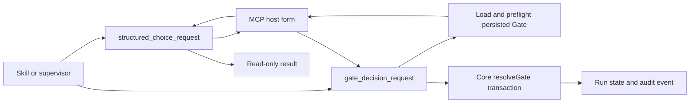
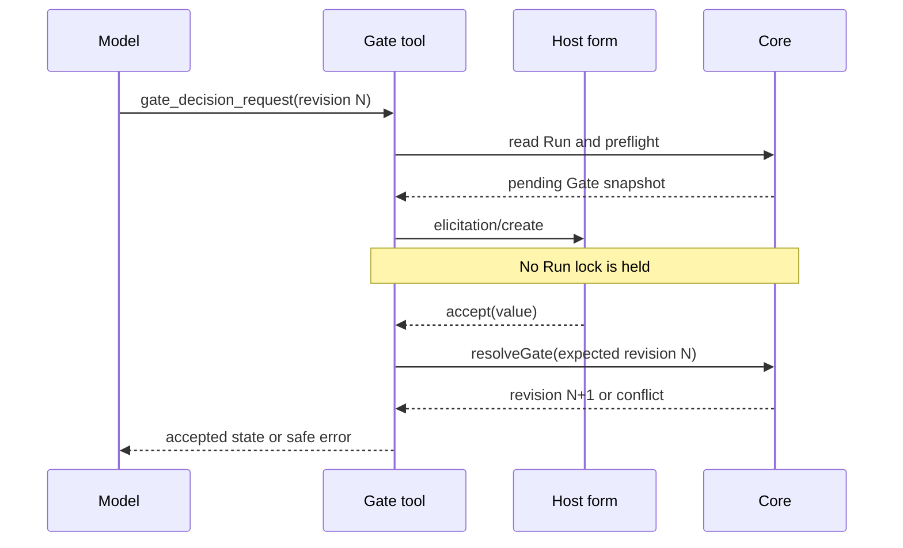

# Structured User Input Design

Date: 2026-07-16

Status: Approved

## Context

AgentFlow currently asks bounded clarification and human-Gate questions as normal chat text. The user must type an option, even when the answer is one of two or three known values. Codex can render MCP form elicitation in Default mode, and the installed MCP SDK exposes `McpServer.server.elicitInput(...)`. The existing Core already persists Gate questions and options and resolves a Gate under a per-Run lock with optimistic revision and Artifact checks.

The design adds structured controls without adding a browser, daemon, per-project installation step, or GUI automation.

## Goals

- Let users click bounded options in Codex Default mode.
- Answer up to three independent questions in one interaction.
- Resolve a persisted human Gate from one accepted selection.
- Keep every decline, cancel, disconnect, malformed response, and conflict non-mutating.
- Preserve current global setup and cross-host fallback.

## Non-Goals

- Free-form, secret, password, token, payment, or OAuth collection.
- Multi-select forms or dependent-question branching inside one form.
- Changing Codex collaboration-mode feature flags.
- A separate web UI or editor automation.
- Automatic Gate approval or a preselected Gate decision.

## Existing Boundaries

- `packages/mcp-server/src/server.ts` owns MCP tool schemas and handlers.
- `packages/mcp-server/src/runtime.ts` resolves immutable project context and creates the Core engine.
- `packages/core/src/engine.ts` is the only Gate transition authority.
- `packages/core/src/store.ts` serializes mutations, checks revision/idempotency, and atomically replaces Run JSON.
- `packages/core/src/model.ts` owns backward-compatible Run persistence schemas.
- `.agents/skills` and `packages/host-adapter/src/routing.ts` provide model-facing workflow policy.
- `scripts/build-distribution.mjs` and global setup already package the runtime and Skills.

## Recommended Shape

Expose two MCP tools backed by one internal structured-choice helper:

1. `structured_choice_request`: read-only clarification for one to three independent questions.
2. `gate_decision_request`: stateful Gate interaction whose form is derived from persisted Run state and whose accepted response is finalized through `AgentFlowEngine.resolveGate`.

The tools are separate because their trust and mutation boundaries differ. The generic tool must never know about a project. The Gate tool must never trust model-supplied question text or allowed values.



## Generic Tool Contract

The input is intentionally narrow:

```json
{
  "message": "Choose the independent setup options.",
  "questions": [
    {
      "id": "scope",
      "prompt": "Which migration scope should be used?",
      "description": "This affects package layout.",
      "options": [
        { "value": "platform-packages", "label": "Platform packages" },
        { "value": "scripts-only", "label": "Scripts only" }
      ],
      "recommended": "platform-packages"
    }
  ]
}
```

Validation rules:

- `message`: 1 to 1,000 characters.
- `questions`: 1 to 3 entries with unique identifier-compatible IDs.
- `prompt`: 1 to 500 characters; optional description is at most 500 characters.
- `options`: 2 to 5 unique stable values and unique non-empty labels.
- Stable values use the existing identifier character set and are at most 160 characters.
- `recommended`, when present, must name a declared value.
- Known secret-bearing prompts and options are rejected.

Each question becomes one required titled single-select property using JSON Schema `oneOf`. The recommended option is ordered first and displayed with `(Recommended)` in its title. No JSON Schema `default` is emitted, so accepting the form still requires an explicit choice.

Accepted output:

```json
{
  "outcome": "accepted",
  "answers": { "scope": "platform-packages" }
}
```

Normal non-accepted outcomes are `declined`, `cancelled`, and `unsupported`. A malformed host response is a structured `ELICITATION_RESPONSE_INVALID` error. Generic execution never resolves a project root and never writes AgentFlow state.

## Capability And Fallback

Before eliciting, inspect `server.server.getClientCapabilities()?.elicitation?.form`. If absent, return:

```json
{
  "outcome": "unsupported",
  "fallback": {
    "instruction": "Present all questions once and submit only explicit user selections.",
    "message": "Choose the independent setup options.",
    "questions": []
  }
}
```

The fallback preserves IDs, prompts, labels, stable values, descriptions, and recommendation. It is data for one concise chat prompt; it is not an answer and has no side effect.

The tool callback passes its MCP `AbortSignal` to `elicitInput`. User decline and cancel are normal outcomes. Abort, timeout, disconnect, or SDK failure returns a stable cancellation/error when a response channel remains available; in every case no project mutation has started.

## Gate Tool Contract

`gate_decision_request` accepts the existing mutation envelope plus `gateId`:

```json
{
  "projectRoot": "D:/project",
  "runId": "run-123",
  "gateId": "requirements-approved",
  "expectedRevision": 5,
  "idempotencyKey": "requirements-approved-v1",
  "actorId": "user-roseee",
  "reason": "Approve the reviewed PRD."
}
```

It does not accept `question`, `options`, `decision`, `choice`, or `resolution`.

Preflight order:

1. Resolve the explicit project and Run.
2. Compute an input fingerprint from the operation, Run, Gate, expected revision, actor, and reason.
3. Check the idempotency record first. An exact completed replay returns current persisted state without opening another form. A different fingerprint is a conflict.
4. Require the current revision to equal `expectedRevision`.
5. Require the Gate to exist, be human, be pending, and belong to the active Stage.
6. Require two to five unique persisted options. No option is synthesized.
7. Capture the current non-stale Stage Artifact IDs and hashes for display/audit context.
8. Elicit one single-select value outside any Run-store transaction.

Selection mapping is deterministic:

- Case-insensitive `reject` or `rejected` maps to `decision: rejected`.
- Every other persisted option maps to `decision: approved` and is supplied as `choice`.
- `approve` or `approved` is also supplied as the selected choice so a concurrent replay can be compared.

After an accepted response, call the existing Core `resolveGate` with the original expected revision and the fingerprinted mutation context. Core rechecks Gate status, actor kind, option validity, required Artifact kinds, and revision while holding the Run lock.



## Idempotency Extension

Add optional `inputHash` to `MutationContext` and `IdempotencyRecordSchema`.

Store behavior remains backward compatible:

- Legacy callers with no hash retain operation-only replay.
- When either the prior record or current mutation has a hash, both hashes must exist and match.
- A mismatch returns `IDEMPOTENCY_CONFLICT` before revision validation or mutation.
- A new record persists only the SHA-256, never question or response content.

The Gate tool checks a matching prior record before elicitation, avoiding a second user interaction. If concurrent same-key calls both reach forms, the Run lock permits at most one mutation. The later caller compares returned Gate status and selected option with its accepted value and reports a conflict if they differ.

## Failure Semantics

| Condition | Result | State change |
|---|---|---|
| Form capability absent | `unsupported` plus fallback | None |
| User declines | `declined` | None |
| User cancels | `cancelled` | None |
| Tool aborts or disconnects | cancellation or structured transport error | None |
| Response misses a field | `ELICITATION_RESPONSE_INVALID` | None |
| Response contains an undeclared value | `ELICITATION_RESPONSE_INVALID` | None |
| Gate missing or not human/pending/active | structured Gate error before form | None |
| Revision changes while form is open | `REVISION_CONFLICT` | None |
| Idempotency key reused for different input | `IDEMPOTENCY_CONFLICT` | None |
| Exact completed replay | `replayed` with current persisted state | None |
| Accepted current Gate selection | `accepted` with new Run state | One Core revision |

Unexpected exceptions retain the existing trace-ID behavior. Tool results and errors must not echo arbitrary response content.

## Skill Policy

Update the routing/discovery/PRD/orchestrator/Codex bridge guidance with one priority:

1. Inspect repository and Run evidence first; do not ask answerable questions.
2. For material bounded clarification, prefer `structured_choice_request` across modes.
3. An already exposed host-native structured-input control is an allowed equivalent.
4. Batch at most three independent questions; dependent questions remain sequential.
5. For a pending human Gate, prefer `gate_decision_request`.
6. Use one concise text fallback only after structured input is unavailable.
7. Never repeat an accepted answer or infer an answer from a recommendation, silence, timeout, or cancellation.

The Codex bridge documents input capability separately from Worker/thread capability. It must not create a user-owned task, automate the GUI, or confuse a Gate request with Worker dispatch.

## Security And Privacy

- Generic inputs and responses are process-local and not persisted by AgentFlow.
- Gate questions and options come only from persisted state.
- Stable bounds prevent oversized forms and option flooding.
- Host responses are checked by the SDK JSON Schema validator and again against exact question IDs and values.
- No passwords, API keys, access tokens, cookies, private keys, payment data, or arbitrary free-form fields are accepted.
- The idempotency hash is non-reversible and contains no selected value.
- Existing project-root containment, actor, Artifact, lock, and atomic-write protections remain in force.

## Testing

Core tests:

- Parse old Run state without `inputHash`.
- Persist and replay a matching hash.
- Reject missing/different hashes when one side is fingerprinted.
- Preserve revision and operation conflict behavior.

MCP tests with linked in-memory transports:

- Advertise form capability and install an `ElicitRequestSchema` client handler.
- Inspect one- and three-question schemas and recommendation labels.
- Accept, decline, cancel, malformed, undeclared, unsupported, abort, and thrown-handler cases.
- Prove generic calls leave the project tree and Run bytes unchanged.
- Prove Gate forms use only persisted question/options.
- Cover approve, reject, named choice, Artifact binding, exact replay, different-input conflict, stale revision, and concurrent calls.

Distribution tests:

- Assert both tools in source and standalone bundle tool lists.
- Assert canonical Skill phrases and bilingual documentation.
- Build, typecheck, run the full suite, create the standalone bundle, install it globally in a temporary home, and exercise a form-capable in-memory or stdio client.

## Deployment And Compatibility

No host configuration schema changes. Rebuild the existing `agentflow-mcp.mjs`, reinstall through the current global setup command, and restart a host only to load the new runtime. Projects need no setup rerun and existing Run files remain valid because `inputHash` is optional.

Clients without form elicitation continue through text fallback. The existing `gate_resolve` tool remains available for compatibility and fallback.

## Rejected Alternatives

- Skill-only `request_user_input`: unavailable in some Codex Default-mode sessions and does not provide a cross-host Gate transaction.
- Browser form: adds a service, focus switching, security surface, and more user operations.
- Holding the Run lock across elicitation: blocks unrelated work for human response time and fails poorly on disconnect.
- Caller-supplied Gate options: allows the model to change the approval contract.
- JSON Schema defaults for recommendations: risks accidental acceptance of a preselected answer.

## Review Checklist

- Generic structured input is read-only.
- Gate options cannot be supplied by the caller.
- No lock is held during human wait.
- Every accepted Gate response is revalidated atomically.
- Every non-accepted path is non-mutating.
- Exact retries avoid a second form.
- Existing setup and project files remain compatible.
